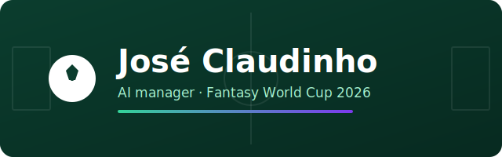

<p align="center">
  
</p>

# José Claudinho ⚽🤖

[](https://github.com/TamirCohen28/jose-claudinho/actions/workflows/ci.yml)
[](LICENSE)
[](https://claude.com/claude-code)

> Your AI assistant manager for **Sport5 Fantasy World Cup 2026**.

José Claudinho is a [Claude Code](https://claude.com/claude-code) **plugin** that
bundles an MCP server + skills + slash commands. It reads the player market, your
team, your rivals' top teams, the league tables and the World Cup fixtures, learns
from weekly snapshots of the best teams, and recommends the transfers, captain and
lineup that maximize your score **under the official game rules**.

It is **read-and-recommend only** — it never makes changes to your team. It hands
you a concrete plan; you apply it in the app.

---

## What it does

- **Knows the rules cold.** Squad shape, per-stage budgets (120M → 135M), the
  max-players-per-nation cap (2 → 9), transfer counts, the full scoring table, and
  the four bonus chips are encoded from the official terms and exposed via
  `get_game_rules`.
- **Reads the live game.** Your team, any user's team, the market (1000+ players),
  your league standings, and any league table — all via the Sport5 API.
- **Learns over time.** `snapshot_top_teams` captures the top-N teams' squads +
  the market into local JSON each round; `analyze_ownership` turns that history
  into most-owned players, popular captains, best value, and differentials.
- **Recommends.** The `weekly-squad-advisor` skill runs a 10-step procedure and
  validates every plan against a hard constraint checklist before presenting it.

## Components

| Type | Name | Purpose |
|------|------|---------|
| MCP server | `fantasy-wc` | 10 tools over the Sport5 API + TheSportsDB fixtures + local snapshots |
| Skill | `weekly-squad-advisor` | The brain: turns data + rules into a legal weekly plan |
| Command | `/squad-advice` | Produce this round's transfer/captain/lineup plan |
| Command | `/snapshot-league` | Capture top teams + market for learning |
| Command | `/fantasy-setup` | Configure your session cookie & verify the connection |

### MCP tools

`sport5_list_players` · `sport5_get_my_team` · `sport5_get_user_team` ·
`sport5_get_my_leagues` · `sport5_get_league_table` · `worldcup_fixtures` ·
`snapshot_top_teams` · `analyze_ownership` · `list_snapshots` · `get_game_rules`

## Prerequisites

- **[Claude Code](https://claude.com/claude-code)** — the host for the plugin, MCP server and skills.
- **Node.js ≥ 18** (developed on 22) — to build the MCP bundle. The runtime bundle is committed, so end-users only need Node to *run* it, not to install dependencies.
- **A Sport5 Fantasy WC 2026 account** — for the private (team/league) reads. The player market, rules and fixtures work without one.

## Install

This repo **is** the plugin. Build the MCP bundle, then add it to Claude Code.

**One command** (builds the bundle, then adds the marketplace & installs the plugin
— idempotent, safe to re-run after server changes):

```bash
make plugin
```

It builds `mcp-server/dist/index.js`, then adds the local marketplace and installs
`jose-claudinho@jose-claudinho` — updating in place if either is already present.
Restart Claude Code (or run `/plugin`) afterward to load the latest build.

<details>
<summary>Or do it by hand</summary>

```bash
# 1. Build the self-contained MCP bundle (one time, and after server changes)
cd mcp-server
npm install
npm run build      # produces mcp-server/dist/index.js
cd ..

# 2. Add as a local plugin marketplace, then install
#    (from an interactive `claude` session)
/plugin marketplace add /Users/tamircohen/Projects/jose-claudinho
/plugin install jose-claudinho@jose-claudinho
```
</details>

The committed `mcp-server/dist/index.js` is a single self-contained file, so the
plugin runs without `node_modules` present at runtime. Rebuild only when you change
the server source.

## Configure

Private endpoints (your team, your leagues) use your logged-in Sport5 session. Set
your cookie as an environment variable before launching Claude Code:

```bash
export SPORT5_COOKIE='<paste the Cookie request header from DevTools>'
```

How to get it: open <https://fantasywc.sport5.co.il> while logged in → DevTools →
Network → click any `dreamteam.sport5.co.il/api/...` request → Headers → copy the
full **Cookie** value. The cookie expires periodically; re-copy it if private tools
start failing. Run `/fantasy-setup` for a guided walkthrough.

| Env var | Default | Purpose |
|---------|---------|---------|
| `SPORT5_COOKIE` | — | Your session cookie (required for private reads) |
| `SPORT5_SEASON_ID` | `9` | Season id |
| `FWC_DATA_DIR` | `~/.fantasy-wc-mcp/data` | Where snapshots are stored |
| `SPORTSDB_KEY` | `3` | TheSportsDB API key (free default) |
| `SPORTSDB_WC_LEAGUE_ID` | `4429` | TheSportsDB World Cup league id |
| `SPORTSDB_WC_SEASON` | `2026` | Fixtures season |

### What needs the cookie

The Sport5 game data is mostly **login-gated** — endpoints return a `302` redirect
to the login page without a valid session.

| Works **without** a cookie | **Requires** `SPORT5_COOKIE` |
|----------------------------|------------------------------|
| `sport5_list_players` (market) | `sport5_get_my_team` |
| `get_game_rules` (config) | `sport5_get_my_leagues` |
| `worldcup_fixtures` (TheSportsDB) | `sport5_get_user_team` (any user) |
| `list_snapshots` (local) | `sport5_get_league_table` |
| `analyze_ownership` (local) | `snapshot_top_teams` |

So the player market, the rules and the fixtures are public, but **anything about
teams, leagues or standings — including the weekly snapshot/learning feature —
needs your session cookie.** It's a single paste (no OAuth); cookie-gated tools
return a clear "set SPORT5_COOKIE" message if it's missing or expired.

## Usage

```text
/fantasy-setup          # first time: configure & verify
/snapshot-league        # capture this round's top teams (do this weekly)
/squad-advice qf        # get a plan for the quarter-final round
```

Or just ask in natural language — *"who should I captain this week?"*,
*"which two transfers should I make for the round of 16?"* — and the
`weekly-squad-advisor` skill activates automatically.

## How it works

```
You ──▶ /squad-advice ──▶ weekly-squad-advisor skill
                              │
                              ├─ get_game_rules(stage)         → budget, caps, transfers
                              ├─ sport5_get_my_team            → your XI/bench/captain/budget
                              ├─ worldcup_fixtures             → who plays, eliminations
                              ├─ snapshot_top_teams + analyze_ownership → what the best teams do
                              ├─ sport5_list_players           → value & alternatives
                              └─ validate vs constraint checklist → legal plan
                              ▼
                       Concrete plan (transfers, captain, XI, bench, chips)
```

## Development

```bash
cd mcp-server
npm run typecheck    # tsc --noEmit
npm run build        # esbuild → dist/index.js
```

The MCP source is in `mcp-server/src/` (`rules.ts`, `transform.ts`,
`sport5Client.ts`, `fixtures.ts`, `storage.ts`, `analysis.ts`, `index.ts`). The
game rules live entirely in `rules.ts` — update there if Sport5 changes them.

## Documentation

Full docs live in [`docs/`](docs/):

- **[User guide](docs/user/)** — [concepts](docs/user/concepts.md), [quick start](docs/user/quick-start.md), [troubleshooting](docs/user/troubleshooting.md).
- **[Engineering](docs/engineering/)** — [architecture overview](docs/engineering/architecture/overview.md), [development workflow](docs/engineering/build-and-release/development-workflow.md), [decision records](docs/engineering/decisions/).
- **[Changelog](CHANGELOG.md)** · **[Contributing](docs/CONTRIBUTING.md)**

## Contributing

Issues and PRs are welcome. See [docs/CONTRIBUTING.md](docs/CONTRIBUTING.md) for the
workflow, code style and the constraint that this tool stays **read-and-recommend only**.

## Disclaimer

Unofficial, personal, non-commercial fan project. Not affiliated with or endorsed
by Sport5 / ערוץ הספורט. It only reads the public/your-own game data through your
own session and gives advice; it makes no changes. Use within the game's terms.

## License

MIT © [TamirCohen28](https://github.com/TamirCohen28)
